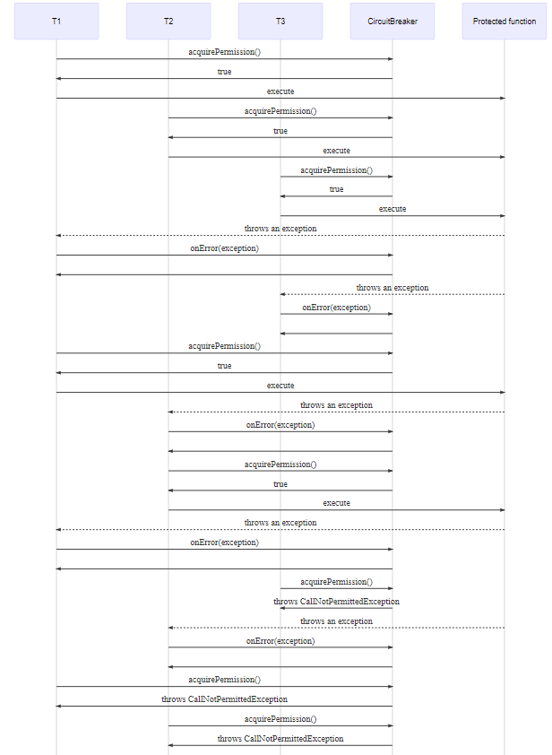

サーキットブレイカー
================
resilience4j-circuitbreakerの利用

[トップページに戻る](../index.md)

# イントロダクション
サーキットブレイカーは3つの通常状態（CLOSED、OPEN、HALF_OPEN）と2つの特別な状態（DISABLED、FORCED_OPEN）による有限状態マシンとして実装されています。


サーキットブレイカーは呼び出し結果の保存と集約にスライディングウィンドウを使います。回数ベースのスライディングウィンドウと、時間ベースのスライディングウィンドウのどちらかを選ぶことができます。回数ベースのスライディングウィンドウは直近N回の呼び出し結果を集約します。時間ベースのスライディングウィンドウは、直近N秒の呼び出し結果を集約します。

# 回数ベースのスライディングウィンドウ
回数ベースのスライディングウィンドウはN個の測定結果からなる循環配列として実装されています。回数ウィンドウのサイズが10の場合、循環配列は常に10個の測定結果を保持します。スライディングウィンドウは合計集約を少しずつ更新します。最も古い測定結果が除外されると、その測定結果は合計集約から差し引かれると共に、バケットがリセットされます（Subtract-on-Evict）。

スナップショットは集約済みかつウィンドウのサイズとは独立しているため、スナップショットの取得にかかる時間は一定O(1)です。この実装のスペース要求（メモリ消費量）はO(n)です。

# 時間ベースのスライディングウィンドウ
時間ベースのスライディングウィンドウはN個の部分集約（バケット）の循環配列として実装されています。タイムウィンドウのサイズが10秒の場合、循環配列は常に10個の部分集約（バケット）を保持します。全てのバケットはある1秒間の全呼び出し結果を集約します（部分集約）。循環配列の先頭バケットは現在の1秒間の呼び出し結果を保持します。他の部分集約は以前の各秒の呼び出し結果を保持します。

スライディングウィンドウは個別の呼び出し結果（タプル）は保持していません。しかし、部分集約（バケット）と合計集約を少しずつ更新します。合計集約は新たな呼び出し結果が記録されたときに少しずつ更新されます。最も古いバケットが除外されると、そのバケットの部分集約は合計集約から差し引かれると共に、バケットがリセットされます（Subtract-on-Evict）。

スナップショットは集約済みかつタイムウィンドウのサイズとは独立しているため、スナップショットの取得にかかる時間は一定O(1)です。呼び出し結果（タプル）は個別に保存されていないため、この実装のスペース要求（メモリ消費量）はほぼO(n)です。N個の部分集約と1個の合計集約のみが作成されます。

1つの部分集約は失敗した呼び出し数、遅い呼び出し、全呼び出し数を数える3つの整数で成り立っています。そして、全呼び出しの合計時間を保持する1つのlongです。

# 失敗率と呼出遅延率の閾値
失敗率が設定可能な閾値以上になったとき、サーキットブレイカーの状態はCLOSEDからOPENになります。例えば記録された呼び出しの50%超が失敗した場合です。デフォルトでは全例外が失敗としてカウントされます。失敗としてカウントされるべき例外のリストは定義可能です。その際、その他の例外は成功としてカウントされます（その例外が無視されなくても）。失敗としても成功としてもカウントされないよう、例外を無視することも出来ます。

呼出遅延率が設定可能な閾値以上になったときも、サーキットブレイカーの状態はCLOSEDからOPENになります。例えば記録された呼び出しの50%超が5秒以上かかった場合です。これにより、外部システムが本当に反応しなくなる前に負荷を減らせます。

失敗率と呼出遅延率は最小呼出数が記録されたときのみ計算されます。例えば最小呼出数が10の場合、失敗率が計算される前に少なくとも10個の呼び出しが記録されていなければなりません。9個の呼び出ししか評価されていない場合は、9個全ての呼び出しが失敗してもサーキットブレイカーはOPENになりません。

サーキットブレイカーがOPENの時は、呼び出しは `CallNotPermittedException` により拒否されます。待ち時間が経過すると、サーキットブレイカーの状態はOPENからHALF_OPENになり、バックエンドがまだ利用不可能か再び利用可能になったかを確認する呼び出しを、設定可能な回数だけ行うことが許可されます。それ以上の呼び出しは、全ての許可された呼び出しが完了するまで `CallNotPermittedException` により拒否されます。失敗率と呼出遅延率が設定可能な閾値以上になったら、状態はOPENに戻ります。失敗率と呼出遅延率が閾値未満になったら、状態はCLOSEDに戻ります。

サーキットブレイカーは、DISABLED（常にアクセス許可）とFORCED_OPEN（常にアクセス拒否）という2つの特別な状態をサポートします。この2つの状態では、サーキットブレイカーイベントは生成されません（状態遷移を除く）。また、メトリクスは記録されません。これらの状態から抜け出す方法は、状態遷移を起こすか、サーキットブレイカーをリセットするかのみです。

サーキットブレイカーは下記のようにスレッドセーフです:

- サーキットブレイカーの状態はAtomicReferenceに保存されている
- サーキットブレイカーは状態を更新する際は副作用なしの関数によるアトミックな操作を行う
- 呼び出しの記録およびスライディングウィンドウからのスナップショットの取得は同期（synchronized）されている

これは、原子性が保証されていることと、ある一時点では1つのスレッドのみが状態やスライディングウィンドウを更新できることを意味します。

しかし、サーキットブレイカーは関数呼び出しを同期しません。これは関数呼び出し自身はクリティカルな部分ではないことを意味します。そうでなければ、サーキットブレイカーは大きなパフォーマンスの代償とボトルネックをもたらします。遅い関数呼び出しは全般的なパフォーマンス/スループットに対する大きな負のインパクトになります。

20の並行スレッドが関数実行の許可を求め、かつサーキットブレイカーがCLOSEDの場合、全スレッドが関数実行を許可されます。スライディングウィンドウのサイズが15であってもです。スライディングウィンドウのサイズは、15の呼び出しのみ並行実行できることを意味しません。並行スレッド数を制限したい場合は、バルクヘッドを使ってください。バルクヘッドとサーキットブレイカーは組み合わせることができます。

1スレッドの例:


3スレッドの例:



# CircuitBreakerRegistryの作成
Resilience4jにはスレッド安全性と原子性保証を提供する、ConcurrentHashMapに基づくインメモリ `CircuitBreakerRegistry` が付属しています。CircuitBreakerインスタンスを管理（生成と取得）するために `CircuitBreakerRegistry` を利用できます。全CircuitBreakerインスタンスのグローバルなデフォルトの `CircutBreakerConfig` を持ったCircuitBreakerRegistryは、下記のように作成します。

```java
CircuitBreakerRegistry circuitBreakerRegistry = 
  CircuitBreakerRegistry.ofDefaults();
```

# CircuitBreakerの作成と設定
カスタムのグローバル `CircuitBreakerConfig` を作成できます。カスタムのグローバル `CircuitBreakerConfig` を作成するには、CircuitBreakerConfigビルダーを使います。ビルダーで下記のプロパティを設定できます。

| プロパティ | デフォルト値 | 説明 |
|----------|------------|-----|
| failureRateThreshold | 50 | 失敗率の閾値をパーセントで設定します。失敗率が閾値以上になった時、CircuitBreakerはOPENに遷移し短絡回路呼び出しを開始します。 |
| slowCallRateThreshold | 100 | 閾値をパーセントで設定します。呼び出し時間が `slowCallDurationThreshold` を超えた時、サーキットブレイカーは呼び出しが遅延していると見なします。呼出遅延のパーセンテージが閾値以上になった時、CircuitBreakerはOPENに遷移し短絡回路呼び出しを開始します。 |
| slowCallDurationThreshold | 60000 [ms] | 呼出が遅延していて呼出遅延率を増やすと見なされる時間を設定します。 |
| permittedNumberOfCallsInHalfOpenState | 10 | CircuitBreakerがHALF_OPENの時に許可される呼び出し回数を設定します。 |
| maxWaitDurationInHalfOpenState | 0 | CircuitBreakerがOPENに遷移する前に、HALF_OPEN状態で待つ最大の待ち時間を設定します。値0は、許可された呼び出しが完了するまで、CircuitBreakerはHALF_OPEN状態で無限に待つことを意味します。
| slidingWindowType | COUNT_BASED | CircuitBreakerがCLOSEDの時に呼び出し結果を記録する際に使われるスライディングウィンドウの種類を設定します。スライディングウィンドウはCOUNT_BASEDまたはTIME_BASEDです。スライディングウィンドウがCOUNT_BASEDの場合、直近の呼び出しが `slidingWindowSize` の数だけ記録および集約されます。スライディングウィンドウがTIME_BASEDの場合、直近の `slidingWindowSize` 秒間の呼び出しが記録および集約されます。 |
| slidingWindowSize | 100 | CircuitBreakerがCLOSEDの時に呼び出し結果を記録する際に使われるスライディングウィンドウのサイズを設定します。 |
| minimumNumberOfCalls | 10 | CircuitBreakerがエラー率を計算できるようになる前に必要となる最小呼び出し回数（各スライディングウィンドウごと）を設定します。例えば、minimumNumberOfCallsが10の場合、エラー率が計算できるようになるまでに少なくとも10個の呼び出しが記録されてなければなりません。もし9個の呼び出ししか記録されていない場合、全呼び出しが失敗してもCircuitBreakerはOPENに遷移しません。 |
| waitDurationInOpenState | 60000 [ms] | OPENからHALF_OPENに遷移する前にCircuitBreakerが待つべき時間を設定します。 |
| automaticTransitionFromOpenToHalfOpenEnabled | false | trueに設定されると、CircuitBreakerは自動的にOPENからHALF_OPENに遷移します。遷移を引き起こすのに、呼び出しは必要ありません。 |
| recordExceptions | empty | 失敗として記録され、ゆえに失敗率を増加させる例外のリストです。マッチする例外、またはリスト内のものを継承した例外は失敗としてカウントされます（ `ignoreExceptions` で明示的に無視されていなければ）。例外のリストを指定した場合、他の全ての例外は成功としてカウントされます（ `ignoreExceptions` で明示的に無視されていなければ）。 |
| ignoreExceptions | empty | 失敗とも成功ともカウントされない、無視される例外のリストです。マッチする例外、またはリスト内のものを継承した例外は失敗とも成功ともカウントされません（ `recordedExceptions` に指定されていても）。 |
| recordException | throwable -> true（デフォルトでは全例外が失敗として記録されます） | 例外が失敗として記録されるかどうかを評価するカスタムのPredicateです。例外が失敗としてカウントされるべき場合、Predicateはtrueを返します。例外が成功としてカウントされるべき場合、Predicateはfalseを返します（ `ignoreExceptions` で明示的に無視されていなければ）。 |
| ignoreException | throwable -> false（デフォルトではどの例外も無視されません） | 例外が無視される（失敗とも成功ともカウントされない）かどうかを評価するカスタムのPredicateです。例外が無視されるべき場合、Predicateはtrueを返します。例外が失敗としてカウントされるべき場合、Predicateはfalseを返します。 |

```java
// CircuitBreakerのためのカスタム設定を作成する
CircuitBreakerConfig circuitBreakerConfig = CircuitBreakerConfig.custom()
  .failureRateThreshold(50)
  .slowCallRateThreshold(50)
  .waitDurationInOpenState(Duration.ofMillis(1000))
  .slowCallDurationThreshold(Duration.ofSeconds(2))
  .permittedNumberOfCallsInHalfOpenState(3)
  .minimumNumberOfCalls(10)
  .slidingWindowType(SlidingWindowType.TIME_BASED)
  .slidingWindowSize(5)
  .recordException(e -> INTERNAL_SERVER_ERROR
                 .equals(getResponse().getStatus()))
  .recordExceptions(IOException.class, TimeoutException.class)
  .ignoreExceptions(BusinessException.class, OtherBusinessException.class)
  .build();

// カスタムのグローバル設定でCircuitBreakerRegistryを作成する
CircuitBreakerRegistry circuitBreakerRegistry 
  CircuitBreakerRegistry.of(circuitBreakerConfig);

// CircuitBreakerRegistryからCircuitBreakerを作成。
// （カスタムのグローバルデフォルト設定）
CircuitBreaker circuitBreakerWithDefaultConfig = 
  circuitBreakerRegistry.circuitBreaker("name1");

// CircuitBreakerRegistryからCircuitBreakerを作成。
// （カスタムの設定）
CircuitBreaker circuitBreakerWithCustomConfig = circuitBreakerRegistry
  .circuitBreaker("name2", circuitBreakerConfig);
```

複数のCircuitBreakerインスタンスで共有できる設定を追加することもできます。

```java
CircuitBreakerConfig circuitBreakerConfig = CircuitBreakerConfig.custom()
  .failureRateThreshold(70)
  .build();

circuitBreakerRegistry.addConfiguration("someSharedConfig", config);

CircuitBreaker circuitBreaker = circuitBreakerRegistry
  .circuitBreaker("name", "someSharedConfig");
```

設定は上書き可能です。

```java
 CircuitBreakerConfig defaultConfig = circuitBreakerRegistry
   .getDefaultConfig();

CircuitBreakerConfig overwrittenConfig = CircuitBreakerConfig
  .from(defaultConfig)
  .waitDurationInOpenState(Duration.ofSeconds(20))
  .build();
```

CircuitBreakerインスタンスを管理するためにCircuitBreakerRegistryを使いたくない場合は、インスタンスを直接生成することも可能です。

```java
// CircuitBreakerのためのカスタム設定を作成
CircuitBreakerConfig circuitBreakerConfig = CircuitBreakerConfig.custom()
  .recordExceptions(IOException.class, TimeoutException.class)
  .ignoreExceptions(BusinessException.class, OtherBusinessException.class)
  .build();

CircuitBreaker customCircuitBreaker = CircuitBreaker
  .of("testName", circuitBreakerConfig);
```

あるいは、ビルダーメソッドを使ってCircuitBreakerRegistryを作ることもできます。

```java
Map <String, String> circuitBreakerTags = Map.of("key1", "value1", "key2", "value2");

CircuitBreakerRegistry circuitBreakerRegistry = CircuitBreakerRegistry.custom()
    .withCircuitBreakerConfig(CircuitBreakerConfig.ofDefaults())
    .addRegistryEventConsumer(new RegistryEventConsumer() {
        @Override
        public void onEntryAddedEvent(EntryAddedEvent entryAddedEvent) {
            // implementation
        }
        @Override
        public void onEntryRemovedEvent(EntryRemovedEvent entryRemoveEvent) {
            // implementation
        }
        @Override
        public void onEntryReplacedEvent(EntryReplacedEvent entryReplacedEvent) {
            // implementation
        }
    })
    .withTags(circuitBreakerTags)
    .build();

CircuitBreaker circuitBreaker = circuitBreakerRegistry.circuitBreaker("testName");
```

Registryの独自実装を差し込みたい場合は、RegistryStoreインタフェースの実装を作成してビルダーメソッドで差し込むことができます。

```java
CircuitBreakerRegistry registry = CircuitBreakerRegistry.custom()
    .withRegistryStore(new YourRegistryStoreImplementation())
    .withCircuitBreakerConfig(CircuitBreakerConfig.ofDefaults())
    .build();
```


# 関数型インタフェースのデコレートと実行
CircuitBreakerでデコレートできるのは `Callable` 、 `Supplier` 、 `Runnable` 、 `Consumer` 、 `CheckedRunnable` 、 `CheckedSupplier` 、 `CheckedConsumer` 、 `CompletionStage` です。デコレートされた関数は、Vavrの `Try.of(...)` または `Try.run(...)` で実行できます。これによりmap、flatMap、filter、recover、andThenでさらなる関数をチェインすることを可能にします。チェインされた関数はCircuitBreakerがCLOSEDまたはHALF_OPENの時のみ実行できます。下記の例では、関数実行が成功した場合は `Try.of(...)` が `Success<String>` モナドを返します。関数が例外をスローした場合 `Failure<Throwable>` モナドが返され、mapは実行されません。

```java
// 与えられた設定
CircuitBreaker circuitBreaker = CircuitBreaker.ofDefaults("testName");

// 関数をデコレートする
CheckedFunction0<String> decoratedSupplier = CircuitBreaker
        .decorateCheckedSupplier(circuitBreaker, () -> "This can be any method which returns: 'Hello");

// mapで他の関数をチェインする
Try<String> result = Try.of(decoratedSupplier)
                .map(value -> value + " world'");

// 関数実行が成功すると、TryモナドはSuccess<String>を返す
assertThat(result.isSuccess()).isTrue();
assertThat(result.get()).isEqualTo("This can be any method which returns: 'Hello world'");
```

# 発行されたRegistryEventsの消費
CircuitBreakerRegistryにイベントコンシューマーを登録し、CircuitBreakerが作成・置き換え・削除された際に処理を実行できます。

```java
CircuitBreakerRegistry circuitBreakerRegistry = CircuitBreakerRegistry.ofDefaults();
circuitBreakerRegistry.getEventPublisher()
  .onEntryAdded(entryAddedEvent -> {
    CircuitBreaker addedCircuitBreaker = entryAddedEvent.getAddedEntry();
    LOG.info("CircuitBreaker {} added", addedCircuitBreaker.getName());
  })
  .onEntryRemoved(entryRemovedEvent -> {
    CircuitBreaker removedCircuitBreaker = entryRemovedEvent.getRemovedEntry();
    LOG.info("CircuitBreaker {} removed", removedCircuitBreaker.getName());
  });
```

# 発行されたCircuitBreakerEventsの消費
CircuitBreakerEventとは状態遷移、サーキットブレイカーのリセット、成功した呼び出し、記録されたエラー、無視されたエラーです。全てのイベントは、イベント作成日時や呼び出しの処理時間などの追加情報を含んでいます。イベントを消費したい場合は、イベントコンシューマーを登録する必要があります。

```java
circuitBreaker.getEventPublisher()
    .onSuccess(event -> logger.info(...))
    .onError(event -> logger.info(...))
    .onIgnoredError(event -> logger.info(...))
    .onReset(event -> logger.info(...))
    .onStateTransition(event -> logger.info(...));
// 全イベントを消費したい場合:
circuitBreaker.getEventPublisher()
    .onEvent(event -> logger.info(...));
```

固定長の循環バッファーにイベントを保存するCircularEventConsumerを使うこともできます。

```java
CircularEventConsumer<CircuitBreakerEvent> ringBuffer = 
  new CircularEventConsumer<>(10);
circuitBreaker.getEventPublisher().onEvent(ringBuffer);
List<CircuitBreakerEvent> bufferedEvents = ringBuffer.getBufferedEvents()
```

EventPublisherをReactive Streamに変換するために、RxJavaまたはRxJava2アダプターを利用できます。

# RegistryStoreの上書き
インメモリのRegistryStoreを独自実装で上書きすることができます。例えば、ある時間が経過した後に利用されていないインスタンスを削除するようなキャッシュを使いたい場合です。

# リンク
- [トップページ](../index.md)
- [CircuitBreakerのサンプルコード](circuitbreaker-examples.md)
